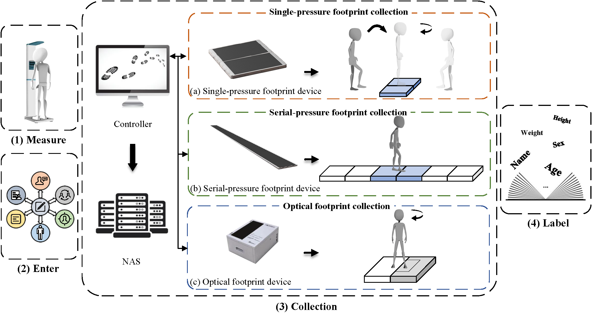
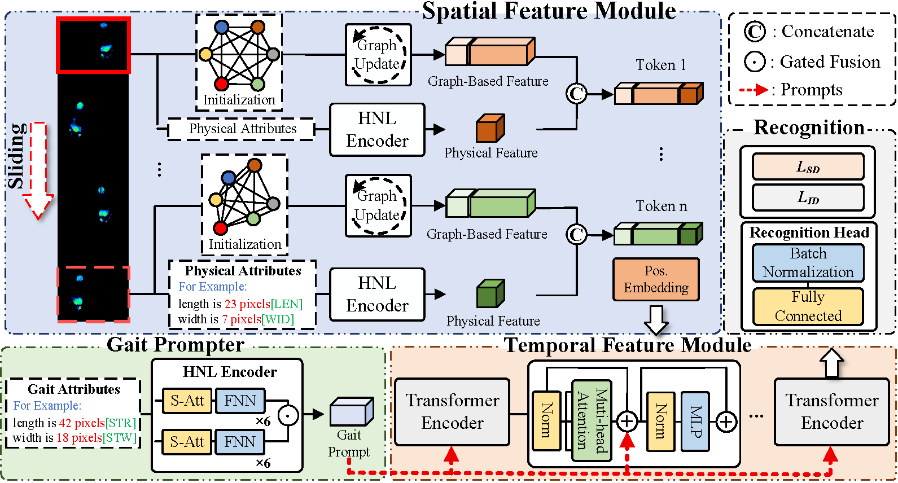

# Multimodal Footprint Dataset for Identification (MFID-200)

## Sample display of MFID-200

## Intorduction
The multimodal footprint dataset (MFID-200) of 200 subjects, which contains single-pressure footprints, serial-pressure footprints, and optical footprints, for a total of about 23,200 images and 157,600 footprints. The MFID-200 is built at the Footprint Sensing and Analysis Laboratory of Anhui University, where we use a single-pressure footprint collection device, a serial-pressure footprint collection device, and an optical footprint collection device to collect footprints.

## Spatial–Temporal Prompted Transformer

## Download
Deom of the MFID-200 can be viewed in the repository click [here](https://github.com/MFIDteam/MFID-200/tree/main/demo).

After the paper is accepted you can download the MFID-200 through [Google Drive]() or [Baidu Drive](https://pan.baidu.com), get the following files:

• "./Optical": Optical footprint images of 200 subjects in this folder. (3.2G)

• "./Serial-pressure": Serial-pressure footprint images of 200 subjects in this folder. (27.2G)

• "./Single-pressure": Single-pressure footprint images of 200 subjects in this folder. (2.6G)

• "./division rules-footprint recognition.txt": file list of division rules for footprint recognition.

• "./division rules-other tasks.txt": file list of division rules for other tasks.

• "./Labels.xlsx": file list of labels.

## Contact
For questions and result submission, please contact Nian Wang at wnianahu@163.com
    
